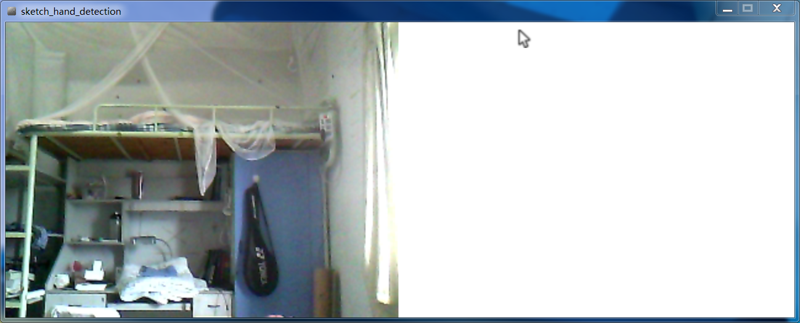
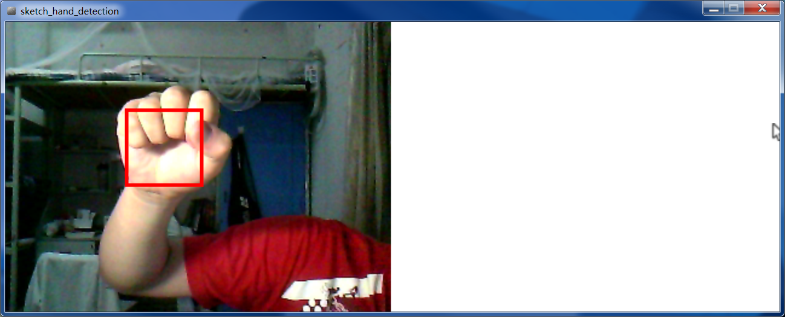
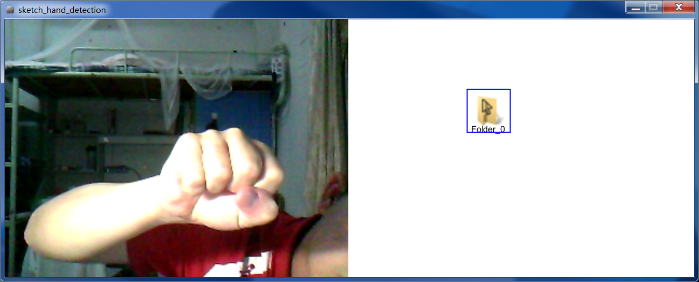
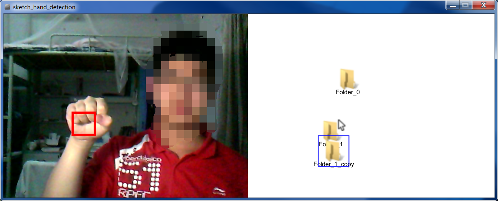
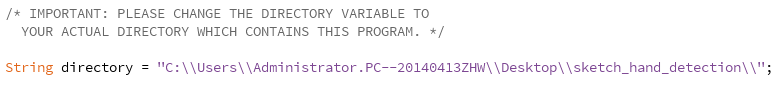

# HCI Final Project Documentation
---------------
**by 1352847 Junpeng Ouyang**
**Email: JoshOY789@gmail.com**

This project is open sourced on [my github](https://github.com/JoshOY):


[TOC]


---------------

## Description

### First things first

This simple program is based on [Processing language](https://processing.org/) and [OpenCV for Processing](https://github.com/atduskgreg/opencv-processing) library.
To run this program you have to make sure that you've got a camera on your PC.
The window is separated into two parts: the left one which contains the video of your camera, and right side looks like a file browser.

**You may not ablto run the program due to some environment setting problems.**
**Please read the "How to setup the environment"chapter carefully.**

### Moving the cursor



To control the cursor on the right screen, you need to raise your fist and let it captured by the camera.
The program will automatic recognize the fist and draw a rectangle surrounding it.



Sometimes there may be several fists or other similar stuffs recognized. But the program will choose the largest "fist" recognized to control the cursor.
When recognized your fist, move it around. The cursor will move in the same direction as your fist in the camera.

**Notice: ** If the program does not perform well, please try to find some other place or background, or change the source of light.

### Keyboard operations

1. Now that you learnt how to control the cursor moving around on the right screen, now press ```N``` key on your keyboard to create a new "folder".

Then you will see an folder icon shows on your screen.
The blue rectangle means the folder is being "selected". That means you are focusing on it, and there are some other operations on it.
2. Now try pressing ```C``` to copy the folder you selected.

The name of copied folders is depend on the origin ones.
3. Hold ```M``` to move the selected folder around the screen.
4. Press ```D``` to delete the folder selected. It will disappear.

### Some disadvantages

Sometimes the camera may not started by the program. Just restart program and it will be solved.

In this program it's easy to handle the gesture classifying by using OpenCV library. But the limitation is that the ```aGest.xml``` does not perform well when the environment changes. So I tried to search on internet and found another cascade file ```fist.xml```.

----------------------

## How to setup the environment

### aGest.xml

Firstly please enter the directory of the program and find ```aGest.xml``` in ```./data``` folder.
And copy it to your **Processing OpenCV library folder**.
To do this, open ```My document``` folder in Windows Operating System. Find the ```Processing``` folder and open it.
Enter ```libraries\opencv_processing\library\cascade-files\``` and copy ```aGest.xml``` into the folder.


**What if I can't find a directory called "Processing" or "opencv_processing"?**
*For the first case, please download Processing first and install it.*
*For the second case, open Processing, "Sketch -> import library -> Add library..." and download opencv for processing library. *

### Change the directory variable

Now open the folder(```sketch_hand_detection```) of the program. Open the program file ```sketch_hand_detection.pde``` and edit it.

Find the following codes:

Now change it to the directory which contains the program. For example, you put the program folder into ```F:\```, then you need to change the directory variable into ```F:\\sketch_hand_detection\\```. (Don't miss the last double slashes).

Make sure the inner structure of folder doesn't change.

That's all.

----------------------

## About the implementation

### Basic structure

The program contains these two main functions:

```processing
void setup() { ... }
void draw() { ... }
```

When the program starts, the setup() function will be executed.
And on every time the frame rendered, draw() function will be called.

### How to use OpenCV

We use [OpenCV for Processing](https://github.com/atduskgreg/opencv-processing) library to handle the main part of our program.
To import the library:
```processing
import gab.opencv.*;
```
We can create an global ```OpenCV``` object ```opencv```.
```processing
OpenCV opencv;
...
opencv = new OpenCV(this, 320, 320);
```

And load the cascade file, which contains the trained classifier.
```processing
opencv.loadCascade("aGest.xml");
```

Then we create a classifier. On each frame, the ```opencv``` object will detect and returns the areas of recognized fists:
```processing
Rectangle[] hands = opencv.detect();
```

So we can get the position of the rectangle areas and draw them on the screen.
But we use the largest one as the controlling fist.
```processing
    int area = 0;
    int biggestHandIndex = 0;
    for (int i = 0; i < hands.length; ++i) {
        if (area < hands[i].width * hands[i].height) {
            biggestHandIndex = i;
            area = hands[i].width * hands[i].height;
        }
    }
    
    for (int i = 0; i < hands.length; ++i) {
        // println("Hand[" + i + "] Position: (" + hands[i].x + ", " + hands[i].y + ")");
        if (i == biggestHandIndex) {
            stroke(255, 0, 0);
            rect(hands[i].x, hands[i].y, hands[i].width, hands[i].height);
            prevX = handX;
            prevY = handY;
            handX = (hands[i].x + hands[i].width) / 2;
            handY = (hands[i].y + hands[i].height) / 2;
            
            stroke(0, 255, 0);
            continue;
        }
        rect(hands[i].x, hands[i].y, hands[i].width, hands[i].height);
    }
```

### The cursor and folders

Both of their icons are ```PImage``` objects. The main difference is we need only one cursor but many folders.
Thus we create a class called ```Folder```:

```java
class Folder {
    private PImage img;
    private int posX;
    private int posY;
    private String folderName;
    private boolean deleted;
    
    public int getX() { return this.posX; }
    public int getY() { return this.posY; }
    public String getFolderName() { return this.folderName; }
    
    public Folder() {
        this.img = loadImage(folderImgUrl);
        img.resize(folderImgSize, folderImgSize);
        this.deleted = false;
    }
    
    public Folder setPos(int x, int y) {
        this.posX = x;
        this.posY = y;
        return this;
    }
    
    public Folder setFolderName(String name) {
        this.folderName = name;
        return this;      
    }
    
    /*
    Function onDraw
    This function will be called every time on draw()
    */
    public void onDraw() {
        image(this.img, this.posX, this.posY);
        text(folderName, this.posX + folderImgSize / 2, this.posY + folderImgSize + 5);
    }
    
    public void delete() {
        this.deleted = true;
        this.posX = -200;
        this.posY = -200;
    }
}
```

Then every folder is an object, and it's easier to handle them with an ```ArrayList```:
```processing
import java.util.*;

ArrayList<Folder> folderList;
```

Every frame we run these codes in function draw() to iterate the array and render the icons and texts:

```java
Iterator<Folder> it = folderList.iterator();
while (it.hasNext()) {
    Folder currentFolder = it.next();
    currentFolder.onDraw();
}
```

For the cursor, it's easier:

```processing
image(cursor, cursorX, cursorY);
```

### Keyboard operations handling


Processing provides us ```keyPressed()``` and ```keyReleased()``` functions to handle the keyboard operations.
There's a global variable ```key``` which is dynamic following the key we pressed on keyboard.
When we press a key, we only need to enumerate the possible cases. 
Here we use a integer ```opMode``` to represent the stat.
```processing
void keyPressed() {
    // Case: Moving
    if (key == 'm' || key == 'M'){
        opMode = 1;
        if (folderSelected != null) {
            folderSelected.setPos(cursorX, cursorY);
        }
    }
    // Case: Copy
    else if(key == 'c' || key == 'C'){
        opMode = 2;
    }
    // Case: Delete
    else if(key == 'd' || key == 'D'){
        opMode = 3;
    }
    // Case: Create
    else if(key == 'n' || key == 'N'){
        opMode = 4;
    }
    else {
        opMode = -1;
    }
}
```

On key release part:
```processing
void keyReleased() {
  if (opMode == 2) {
      if (folderSelected != null) {
            Folder nf = new Folder();
            nf.setFolderName(folderSelected.getFolderName() + "_copy")
              .setPos(cursorX, cursorY + folderImgSize);
            folderList.add(nf);
            println("A new folder copyed!");
      }
  }
  else if (opMode == 3) {
      if (folderSelected != null) {
          folderSelected.delete();
          folderSelected = null;    
      }
  }
  else if (opMode == 4) {
      Folder nf = new Folder();
      nf.setFolderName("Folder_" + folderList.size())
        .setPos(cursorX, cursorY);
      folderList.add(nf);
      println("A new folder created!");
  }
  opMode = -1;
}
```

-----------------

## Licence

The MIT License (MIT)

Copyright (c) 2015 Josh Ouyang

Permission is hereby granted, free of charge, to any person obtaining a copy of this software and associated documentation files (the "Software"), to deal in the Software without restriction, including without limitation the rights to use, copy, modify, merge, publish, distribute, sublicense, and/or sell
copies of the Software, and to permit persons to whom the Software is
furnished to do so, subject to the following conditions:

The above copyright notice and this permission notice shall be included in all
copies or substantial portions of the Software.

THE SOFTWARE IS PROVIDED "AS IS", WITHOUT WARRANTY OF ANY KIND, EXPRESS OR
IMPLIED, INCLUDING BUT NOT LIMITED TO THE WARRANTIES OF MERCHANTABILITY,
FITNESS FOR A PARTICULAR PURPOSE AND NONINFRINGEMENT. IN NO EVENT SHALL THE
AUTHORS OR COPYRIGHT HOLDERS BE LIABLE FOR ANY CLAIM, DAMAGES OR OTHER
LIABILITY, WHETHER IN AN ACTION OF CONTRACT, TORT OR OTHERWISE, ARISING FROM,
OUT OF OR IN CONNECTION WITH THE SOFTWARE OR THE USE OR OTHER DEALINGS IN THE
SOFTWARE.

